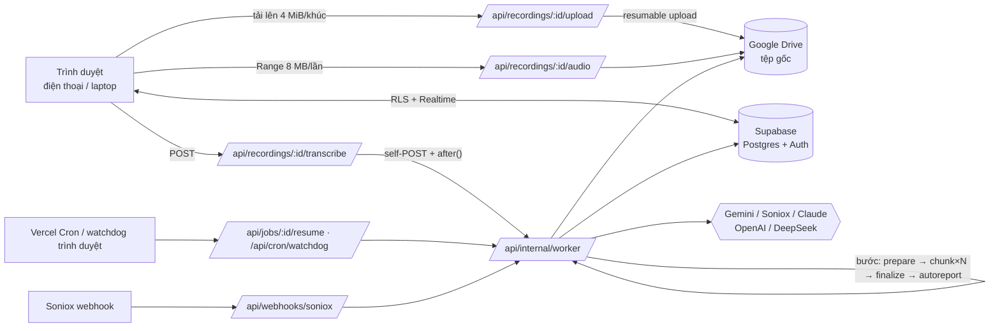

# Kiến trúc MeetingAI

Tài liệu này mô tả cách các thành phần phối hợp. Cơ sở lựa chọn công nghệ xem [RESEARCH.md](RESEARCH.md).

## 1. Thành phần

| Thành phần | Vai trò |
|---|---|
| **Next.js 16 (App Router) trên Vercel** | Giao diện (React 19, Tailwind v4) và API (Route Handlers). Worker xử lý nền cũng là một route. |
| **Supabase** | PostgreSQL (dữ liệu, phân quyền RLS), Auth (email/Google), Realtime (chat, tiến độ phiên âm). |
| **Google Drive** | Lưu **tệp ghi âm gốc nguyên vẹn** (không nén lại) bằng tài khoản Drive của đơn vị, phạm vi `drive.file`. |
| **Nhà cung cấp AI** | Gemini, Soniox (phiên âm); Gemini, Claude, OpenAI, DeepSeek, API tương thích OpenAI (nhận diện tên, hiệu đính, báo cáo, hỏi đáp). |
| **ffmpeg (ffmpeg-static)** | Giải mã, đo âm lượng, dò khoảng lặng, cắt đoạn FLAC — chỉ đóng gói vào route worker. |

## 2. Tải lên và phát lại

- **Tải lên:** Vercel giới hạn thân request 4,5 MB, nên trình duyệt gửi từng khúc 4 MiB (bội số 256 KiB theo yêu cầu của Drive) qua `/api/recordings/[id]/upload`. Server mở **resumable session** trên Drive, chuyển tiếp từng khúc và trả `offset` kế tiếp. Mất mạng giữa chừng thì hỏi trạng thái phiên và **tiếp tục từ byte còn thiếu**.
- **Ghi âm trực tiếp:** các khúc ghi được lưu tạm vào IndexedDB, nên đóng tab hay mất điện vẫn khôi phục được. Wake Lock giữ màn hình sáng. Ghi âm tắt echo cancellation, noise suppression và AGC để giữ tín hiệu gốc.
- **Phát lại:** `/api/recordings/[id]/audio` kiểm tra quyền xem qua RLS, rồi chuyển tiếp HTTP Range sang Drive. Mỗi phản hồi `206` tối đa 8 MB, nên tua nhanh được trên cả Safari/iOS.
- **Phiên âm không lưu tệp** (`target: "temp"`): khi chưa kết nối hoặc không tải được lên Drive, cùng API tải lên ghi từng khúc 4 MiB thành các đối tượng `audio-temp/<recording>/<offset>.part` trong Supabase Storage (bucket riêng tư, chỉ service role; mỗi phần dưới giới hạn 50 MB/tệp của gói Free). Tiếp tục khi mất mạng bằng cách đếm số byte liền mạch đã có. Đủ phần thì `upload_status = 'temporary'`.
  - Bước *prepare* ghép các phần vào `/tmp` rồi xử lý như tệp Drive (vì vậy giới hạn 200 MB).
  - Khi transcript đã lưu (job `done`) và không còn job nào khác cần tệp, các phần bị xoá và `upload_status = 'discarded'`: bản ghi chỉ giữ transcript. Job lỗi thì giữ tệp tạm để "Thử lại"; cron `watchdog` xoá tệp tạm quá 7 ngày và phiên tải lên tạm bỏ dở.
  - Tải tệp lên sau (trang bản ghi): lên Drive nếu đã kết nối (tệp tạm cũ bị xoá), nếu không thì lại giữ tạm và mở sẵn hộp thoại phiên âm lại.

## 3. Pipeline phiên âm

### 3.1 Điều phối nền trên Vercel

Một hàm Vercel chạy tối đa 300 s (gói Hobby). Vì vậy mỗi **bước** là một lần gọi riêng:

1. `POST /api/internal/worker` (xác thực bằng header `x-worker-secret`) trả `202` ngay.
2. Công việc chạy trong `after()` với ngân sách thời gian 250 s.
3. Trạng thái tác vụ và từng đoạn nằm trong CSDL (`transcription_jobs`, `transcription_chunks`).

Để không bước nào chạy hai lần, mỗi bước **giành quyền** bằng hàm SQL nguyên tử `claim_job` / `claim_transcription_chunk`. Tác vụ không cập nhật quá 420 s bị coi là treo và được phép giành lại.

Khôi phục tác vụ treo, theo ba đường:

- Trang đang mở có watchdog phía trình duyệt: sau 90 s không tiến triển, nó gọi `/api/jobs/[id]/resume`.
- Vercel Cron gọi `/api/cron/watchdog`.
- Người dùng bấm "Thử lại". Các đoạn lỗi được đặt lại, đoạn đã xong được giữ.

Trạng thái tác vụ: `queued → preparing → transcribing → finalizing → done` (hoặc `error` / `canceled`).

### 3.2 Engine Gemini (mặc định)

1. **prepare**
   - **Mở tệp gốc.**
     - Tệp ≤200 MB: tải vào `/tmp`.
     - Tệp lớn hơn (vd. WAV 1–2 GB): ffmpeg đọc thẳng từ Drive qua HTTPS + Range, không chiếm `/tmp` (Vercel giới hạn 500 MB).
     - Không tạo tệp WAV trung gian.
   - **Một lượt giải mã để phân tích:**
     - Đưa về 16 kHz mono, lọc highpass 70 Hz.
     - Đo RMS từng khung 100 ms, suy ra thời lượng thực và âm lượng trung bình.
     - Lấy nền ồn = bách phân vị 10, mức lời nói = bách phân vị 90.
     - **Ngưỡng lặng** = nền ồn + 25% khoảng cách tới mức lời nói (tối thiểu +3 dB), giới hạn [−60, −20] dB.
     - Khoảng lặng là chuỗi khung dưới ngưỡng dài ≥0,5 s.
     - Ví dụ bản ghi giao ban hội trường 40 phút: nền −40 dB, lời −23,7 dB → ngưỡng −35,9 dB, 18% thời lượng là khoảng lặng; mất khoảng 3,4 s CPU.
   - **Lập kế hoạch đoạn:**
     - Mỗi đoạn khoảng 10 phút (tuỳ chỉnh), **cắt ở giữa khoảng lặng** trong vùng ±90 s.
     - Đoạn cuối không ngắn hơn 2 phút.
     - Không tìm được khoảng lặng thì cắt cứng và chồng lấn 8 s.
   - **Mã hoá từng đoạn:**
     - Cắt thẳng từ tệp gốc sang FLAC 16 kHz mono 16-bit, khoảng 11 MB mỗi 10 phút.
     - Mặc định **cân bằng âm lượng tuyến tính**: cùng một mức khuếch đại cho cả bản ghi, đưa âm lượng trung bình về khoảng −22 dBFS, có chặn đỉnh. Cách này giữ nguyên động học giọng nói và nhanh gấp khoảng 28 lần `loudnorm` một lượt.
     - Tuỳ chọn khác: `dynaudnorm` (người nói xa micro) hoặc giữ nguyên.
     - **Không khử nhiễu mặc định.**
   - Tải từng đoạn lên Gemini Files API, rồi xoá tệp tạm ngay.
2. **chunk ×N**
   - Đoạn 0 chạy trước để lập **danh sách người nói**.
   - **Phân vai bằng giọng mẫu** (`voiceRefs`, mặc định bật; `src/lib/transcription/voice-refs.ts`):
     - Các đoạn chạy **tuần tự**: đoạn k chỉ được nhận khi mọi đoạn trước đã xong.
     - Trước đoạn k, worker thống nhất người nói của các đoạn 0..k-1 thành khoá toàn cục (danh sách cộng dồn). Người chưa có giọng mẫu (nói ≥ 4 s, tối đa 8 người, ưu tiên người nói nhiều) được cắt một đoạn 3,5–12 s từ tệp gốc: câu chỉ một người nói, không chồng lấn, không có [?], thu hẹp mép 0,2 s. Đoạn mẫu tải lên Files API.
     - Lời gọi đoạn k: tệp chính đứng đầu (mốc thời gian tính trên tệp này), sau đó các giọng mẫu có nhãn ("Giọng mẫu S1 — Thầy (Chủ tọa)"), cuối cùng là lời dặn. Mô hình so giọng để gán ID; giọng không khớp mẫu nào → ID mới.
     - Câu trùng lời giọng mẫu (mô hình lỡ phiên âm cả giọng mẫu) bị loại trước khi lưu đoạn.
     - Giọng mẫu trên Gemini không còn (403) → phiên âm đoạn đó không kèm mẫu, đoạn sau cắt lại mẫu. Lỗi khi cắt mẫu chỉ ghi cảnh báo.
     - Tắt tuỳ chọn: chạy như cũ — tối đa 3 đoạn song song, chỉ có danh sách người nói bằng chữ của đoạn 0.
   - Các đoạn sau nhận danh sách người nói kèm tên người tham dự và từ điển thuật ngữ.
     - Phân vai theo **giọng**, không theo vai trò hay độ dài lượt lời (chủ tọa vừa điều hành vừa giảng giải vẫn một ID).
     - Chỉ dùng lại ID khi chắc chắn cùng người; giọng mới hoặc không chắc → ID mới dạng `M1, M2…` riêng cho đoạn đó. Nhờ vậy người mới ở hai đoạn chạy song song không bị gộp nhầm vào một ID. Tách nhầm còn gộp lại được, gộp nhầm hai người thì không.
   - Đầu ra là JSON theo schema: câu `{start, end, speaker, text}` và người nói.
   - JSON bị cắt ngang được sửa rồi gắn cờ.
   - **Thử lại có giãn cách** (`src/lib/transcription/retry.ts`):
     - Đoạn lỗi được trả về hàng chờ kèm `next_attempt_at`; SQL không cho worker nào nhận đoạn trước hạn đó. Chờ lâu hơn 90 s thì worker ngủ một quãng rồi tự gọi lại chính nó.
     - Lỗi nhất thời (Gemini quá tải 503 "high demand", 429, lỗi mạng): tới 8 lần, chờ 15 s → 30 s → 1 → 2 → 3 phút (~13 phút). Lỗi khác (đầu ra rỗng, JSON hỏng): 3 lần, chờ 10 s rồi 20 s.
     - **Mô hình dự phòng:** kết nối có thể khai báo `fallbackModel`. Mô hình chính quá tải (503) hoặc hết lượt (429) 2 lần thì đoạn đó chuyển sang mô hình dự phòng; các đoạn sau dùng luôn dự phòng trong 15 phút. Quét bổ sung, đặt tên người nói, soạn văn bản cũng chuyển như vậy. Transcript ghi chú đoạn nào dùng dự phòng.
     - **Tệp đoạn trên Gemini không còn** (Files API chỉ giữ 48 giờ, hoặc khoá API đã đổi sang dự án khác → 403 "permission to access the File"): không coi là sai khoá; worker mã hoá lại đúng đoạn đó từ tệp gốc, tải lên lại rồi gọi lại ngay.
     - Hết lượt vẫn lỗi thì tác vụ báo lỗi. Nút "Thử lại" chỉ xử lý tiếp các đoạn lỗi, giữ nguyên các đoạn đã xong.
     - Lỗi nhất thời khi "Kiểm tra kết nối" chỉ được ghi lại, không đánh dấu kết nối hỏng (chỉ lỗi khoá 401/403 hay mô hình sai mới làm vậy).
3. **finalize**
   - Ghép các đoạn:
     - chuyển mốc thời gian về tuyệt đối
     - bỏ câu trùng ở vùng chồng lấn (so khớp văn bản)
     - cắt vòng lặp lặp lại
     - bỏ câu chỉ có chú thích tiếng động / [không nghe rõ] (không tạo người nói ảo)
     - thống nhất người nói giữa các đoạn theo tên (ID `M…` luôn được cấp khoá toàn cục mới)
   - **Đo độ phủ**: so vùng có tiếng nói (từ khoảng lặng) với vùng đã có chữ.
     - Khoảng hở lớn được **phiên âm bổ sung**, tối đa 10 cửa sổ.
     - Câu bổ sung gắn cờ `gap_fill`.
   - **Hiệu đính thuật ngữ** (tuỳ chọn): LLM chỉ đề xuất sửa, mã kiểm chứng từng đề xuất (khoảng cách Levenshtein, khớp từ điển) trước khi áp dụng.
   - **Nhận diện tên người nói**: LLM trả JSON tên, vai trò, độ tin cậy.
     - Chỉ áp dụng tên có độ tin cậy cao hoặc vừa.
     - Chỉ gộp người nói khi độ tin cậy cao.
     - Một khoá chỉ mang một tên và một vai trò (không ghép "BS. A / BS. B").
     - "Thành phần tham dự" có vai trò (vd "Thầy Hiển (chủ tọa)") mà đúng một người nói thể hiện vai trò đó → được gán tên với độ tin cậy vừa, kể cả khi tên không được gọi. Không tự thêm học hàm, học vị.
   - Lưu transcript:
     - `original_segments` là bản máy gốc, lấy **trước** bước AI hiệu đính thuật ngữ, không bao giờ sửa.
     - `segments` là bản đang dùng, có thể hiệu đính.
     - Kèm `quality`: độ phủ và cảnh báo.
     - `model` là mô hình **thực** đã phiên âm (vd `gemini-2.5-flash` khi mọi đoạn phải chạy dự phòng), không phải mô hình chính của kết nối. Báo cáo cũng ghi mô hình thực đã trả lời.
4. **autoreport** (tuỳ chọn): tự tạo văn bản tổng hợp theo template đã chọn khi tải lên.

### 3.3 Engine Soniox (`stt-async-v5`)

- Tải lên Soniox **nguyên tệp gốc** nếu là định dạng phổ biến (m4a, mp3, wav, flac, ogg, webm…). Trường hợp khác mã hoá FLAC 16 kHz. Kèm ngữ cảnh: tên người tham dự và thuật ngữ.
- Soniox **phân vai theo đặc trưng âm học trên toàn bộ tệp**, nên người nói nhất quán suốt buổi.
- Kết quả về qua webhook (có bí mật riêng) hoặc qua thăm dò định kỳ.
- Token được gom thành câu: tách khi đổi người nói, khi ngắt quá 1,5 s, khi hết câu, hoặc khi câu dài quá 30 s.
- Sau đó chạy cùng bước hiệu đính thuật ngữ và nhận diện tên như engine Gemini.

## 4. Lớp AI

- **Kết nối** (`ai_connections`):
  - Gồm: nhà cung cấp, base URL, khoá API mã hoá AES-256-GCM, mô hình, tham số.
  - Tham số gồm: effort, verbosity, temperature, top-p, max tokens, JSON bổ sung.
  - Trạng thái kiểm tra (`ok/error/untested`) kèm độ trễ.
  - Phạm vi: `org` (dùng chung) hoặc `user` (cá nhân).
- **Phân công** (`ai_assignments`): mỗi vị trí (`transcription`, `speaker_naming`, `term_correction`, `report`, `chat`) trỏ tới một kết nối có trạng thái `ok`.
- **Thứ tự chọn kết nối khi chạy:**
  1. Kết nối người dùng chọn tại chỗ.
  2. Phân công cá nhân.
  3. Phân công đơn vị.
  4. Kết nối hợp lệ đầu tiên.
  5. Biến môi trường `GEMINI_API_KEY` / `SONIOX_API_KEY`.
- **Ánh xạ tham số theo nhà cung cấp:**
  - Gemini: effort → `thinkingLevel`.
  - OpenAI Responses API: effort → `reasoning.effort`; verbosity → `text.verbosity`.
  - Claude:
    - adaptive thinking kèm `output_config.effort`
    - prompt caching cho system prompt
    - `fallbacks: "default"` cho Opus 5 / Fable
  - DeepSeek và API tương thích OpenAI: Chat Completions (JSON qua `response_format`).
- **Danh sách mô hình** lấy trực tiếp từ API của nhà cung cấp. Người dùng vẫn nhập tay được mô hình không có trong danh sách.

## 5. Văn bản tổng hợp và hỏi đáp

- **Template:**
  - Có template hệ thống và template tuỳ chỉnh theo phạm vi cá nhân, nhóm hoặc đơn vị.
  - Prompt gồm: hướng dẫn chung, thông tin đơn vị, thông tin cuộc họp, transcript định dạng `[mm:ss] Tên (vai trò): lời`.
  - Kết quả **stream** về trình duyệt và được lưu định kỳ, nên đóng trang vẫn không mất.
- **Xuất DOCX:**
  - Khổ A4, lề trên/dưới 20 mm, trái 30 mm, phải 15 mm, Times New Roman 13, theo thể thức NĐ 30/2020.
  - Bảng không viền cho phần quốc hiệu và chữ ký.
- **Hỏi đáp:**
  - Ngữ cảnh là một bản ghi, hoặc nhiều bản ghi trong nhóm, mỗi bản ghi có mã nguồn R1, R2…
  - Có ngân sách ký tự theo mô hình.
  - Câu trả lời trích dẫn dạng `[R1 05:23]`. Giao diện biến thành nút bấm để nghe lại đúng đoạn.

## 6. Bảo mật và phân quyền

- **RLS trên mọi bảng.**
  - Hàm `SECURITY DEFINER` kiểm tra quyền (`can_view_recording`, `can_edit_recording`, `is_group_member`, …) để tránh đệ quy chính sách.
  - Quyền UPDATE cấp theo **từng cột**, nên người dùng không tự nâng vai trò hay sửa trường hệ thống được.
  - Kiểm thử tự động: `tests/db/rls-test.sql`.
- **Bí mật:**
  - Khoá API và refresh token Drive mã hoá bằng `APP_ENCRYPTION_KEY`, không bao giờ gửi về trình duyệt.
  - Worker xác thực bằng `WORKER_SECRET`, cron bằng `CRON_SECRET`, webhook Soniox bằng bí mật riêng.
- **Drive:**
  - Phạm vi `drive.file`: ứng dụng chỉ thấy tệp do chính nó tạo.
  - Tệp không chia sẻ công khai. Âm thanh chỉ phát qua route có kiểm tra quyền.
- **Tài khoản:**
  - Người đăng ký đầu tiên là quản trị viên.
  - Tuỳ chọn duyệt tài khoản mới (Quản trị → Đơn vị).
  - Tuỳ chọn giới hạn tên miền email (`ALLOWED_EMAIL_DOMAINS`).
- **Thao tác xoá:** mọi thao tác xoá đều hỏi xác nhận. Xoá bản ghi chuyển tệp Drive vào Thùng rác, không xoá vĩnh viễn.

## 7. Realtime và cộng tác

- Chat nhóm và chat 1-1 dùng Supabase Realtime `postgres_changes` trên bảng `messages`, và vẫn tuân thủ RLS.
- Số tin chưa đọc lấy từ RPC `my_channels()`.
- Transcript lưu kèm **số phiên bản** (optimistic concurrency): hai người sửa cùng lúc thì người sau được báo tải lại, không ghi đè nhau.
- Tiến độ phiên âm cập nhật qua Realtime, kèm thăm dò 5 s làm dự phòng.

## 8. Kiểm thử

| Lớp | Lệnh | Nội dung |
|---|---|---|
| Đơn vị | `npm test` | Ghép đoạn, chồng lấn, độ phủ, khoảng lặng, thống nhất người nói, Soniox → câu, sửa JSON, trích dẫn, DOCX, mã hoá |
| CSDL | `scripts/test-db.sh` | Migration + kiểm thử RLS, RPC và hàm giành quyền trên PostgreSQL 16 |
| Kiểu/lint | `npm run typecheck`, `npm run lint` | TypeScript strict, ESLint (Next + React Compiler rules) |
| Pipeline e2e | `tests/e2e/run.sh` | Dữ liệu tổng hợp 25 phút + máy chủ giả lập Google/Gemini/Soniox/Storage. Kiểm tra: chia đoạn, thử lại khi lỗi, Gemini quá tải 503 → mô hình dự phòng, quét bổ sung, đặt tên người nói, hiệu đính có kiểm chứng, bản máy gốc, tự tạo biên bản, phiên âm không lưu tệp |
